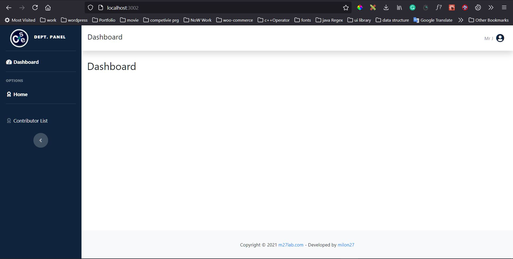

# Use React Context API and Reducers instead of Redux Project Setup (Intitial Project Setup )

**version 1.0.0**

its a Project Setup or starter project for use React Context API and Reducers with bootstrap dashbaord.

>> Features

### 1: Use Context API and Reducers Instead of REDUX

>> how to use

### setp 1: clone the repository 
### setp 2: run : npm install (to install all the packages required)
### step 3: run : npm start (by default it will run on http://localhost:3000/)
### setp 4: make your dream project.

> Screenshot

---
## Author @ milon27
Md jahidul Islam 
IUBAT-CSE 
https://www.m27lab.com/our-portfolio/ 
https://milon27.web.app/
